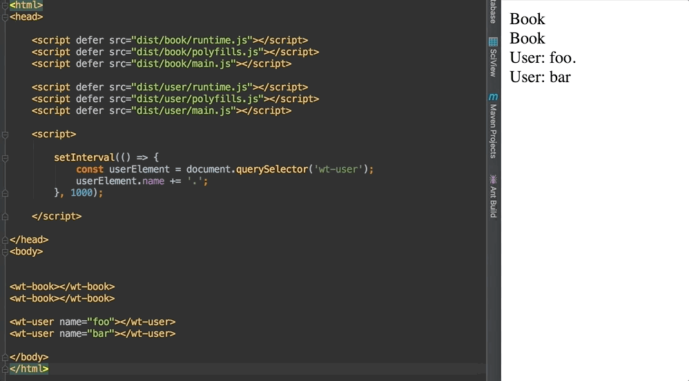

# Wishtack's Angular Elements Demo

This is an angular elements demo using:
* Angular 6 Release Candidate
* Angular Elements Release Candidate 

This repo also features Angular CLI's monorepo approach:

* In this example, there are two apps `book` and `user`.
* They are built separately and produce distinct `javascript` modules that can be included in any non-angular application.
* Both apps can be used on the same page.

WARNING: This is way too experimental for the moment and will get better and cleaner with Angular 6 & 7, Angular CLI 7's "library architect".

## Usage
```
yarn install
yarn start
```

